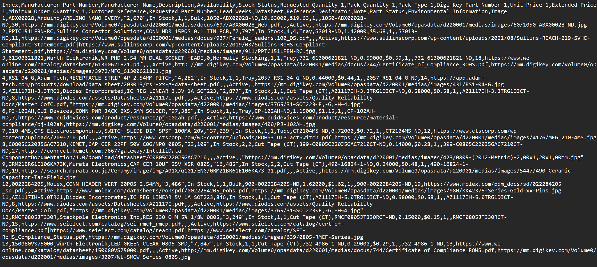
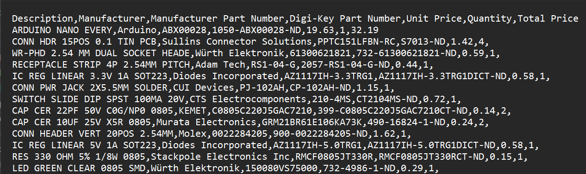

# DigiKey BOM Simplifier

Python Script to simplify to DigiKey's BOM generator.

The DigiKey BOM generator, in my opinion, adds a lot of unnessecary information.
This program reads a BOM from the downloads folder using the pandas python package then
removes unnessecary information, it also renames the columns for easier reading and adds 
a total price. At the end, the user has the option to print and/or save the "new" BOM 
under a modify filename.

The program reads both "CSV" and "XLSX" from the downloads folder, also saves in the downloads.

To run: `python DigiKey_BOM_Editor.py`

DigiKey BOM:

Simplified BOM:
